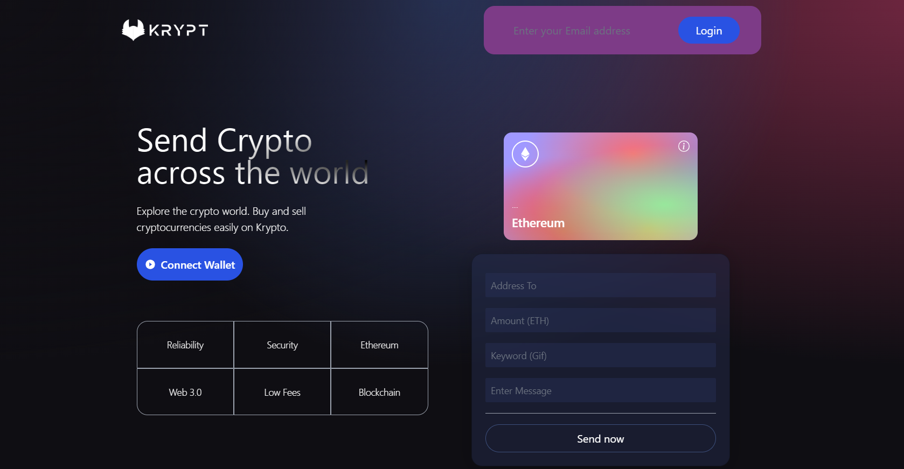
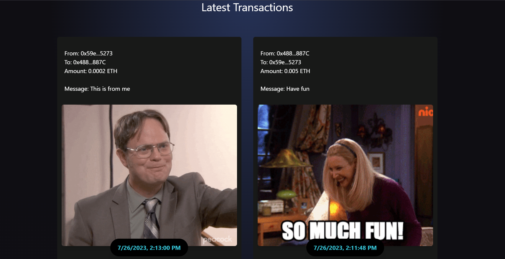
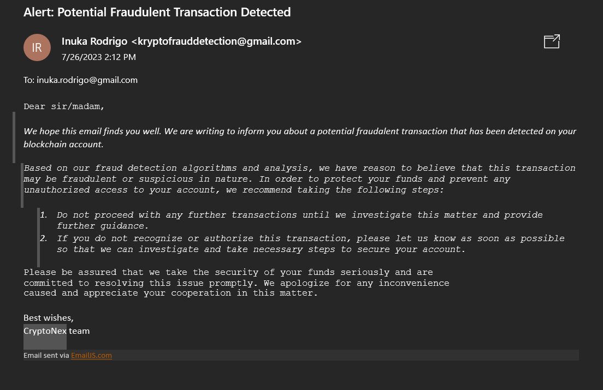

<h1 align="center">CryptoNex - Web-3.0-Blockchain-Application</h1>

### Description
CryptoNex is a `Web3.0 blockchain application` that enables users to send transactions over the blockchain, with each transaction being permanently recorded on the blockchain.

### Demo / UI


### Latest Transactions


### Email Alert (If the transaction is fraudulent)



### Main Functionalities:

 - Users can connect their MetaMask wallets to send ethereum through the blockchain.
 - Each transaction will be paired with a gif and it will be forever stored on the blockchain.
 - Users can access and view their latest transactions (and the gifs associated with them).
 - Every transaction will be reviewed and verified for authenticity, distinguishing between fraudulent and legitimate activity.

### Getting Started
To get a local copy up and running follow these simple example steps.

1. Clone the repo
   ```sh
   git clone https://github.com/prejin2310/Krypt---Web-3.0-Blockchain-Application.git
   ```
2. Install NPM packages
   ```sh
   npm i
   ```
3. Start the app in development mode 
   ```sh
   npm run dev
   ```

### Built With
- [Vite.js (react)](https://vitejs.dev/)
- [Tailwind CSS](https://tailwindcss.com/)
- [Solidity](https://soliditylang.org/)
- [Giphy API](https://developers.giphy.com/)
- [Vercel](https://vercel.com/)

Note - Remember to make a .env file after cloning the project to store the API Key for the GIPHY
